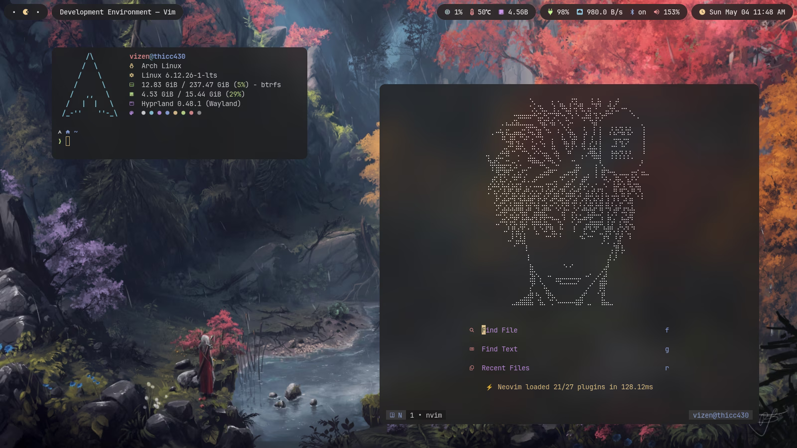

# Vizen dotfiles

Usage:

1. Clone this repo into your home directory
2. Install [stow](https://repology.org/project/stow/versions) on your system
3. `cd` into this repo and stow the things that you need

   e.g. `stow waybar kitty ... etc`
